&mdash; 어떤 점이 서체를 손글씨, 캘리그라피, 글자 도안이나 로고 디자인 같은 것들과 다르게 만들까요?

서체 디자인을 다르게 만드는 가장 큰 이슈는 서체에 포함된 모든 glyph들은 다른 glyph들과 함께 동작해야 한다는 것입니다. 이것은 서체 디자인의 각 단계에서 디자인과 배치가 철저한 조화의 연속이라는 것을 의미합니다. 이러한 점에서 서체 디자인은 훌륭한 글자들의 모음이 아니라 글자들의 훌륭한 모음을 만드는 것이라 할 수 있습니다. 다시 말하면 우리는 훌륭한 하나의 글자를 만드는 방법보다 글자들을 모으고 함께 동작하게 만드는 것을 더 중요하게 생각해야 합니다.

우리는 어떤 단일 부분에 대한 것보다 시스템에 대한 것을 우선해야 하고, 또한 우리의 디자인 과정을 시스템 레벨에서 분석하도록 해야할 필요가 있습니다. 디자인의 시작 단계에서는 글자에 연관된 특징들이 우리가 각별히 집중하는 부분들입니다.

서체 디자인의 또 다른 특이한 점은 우리가 디자인하는 형태에서 많은 부분들이 이미 만들어져 있다는 것입니다. 서체 디자이너로서 우리의 할 일은 완전히 새로운 것을 창조하는 것이 아니라 이미 만들어져 있는 것들을 새롭게 만드는 일입니다. 많은 신입 서체 디자이너들이 이 점에 당황해 합니다. 글을 읽는 사람들을 불편하게 하지 않으면서 흥분되게 만드는 적당한 변화의 량을 찾는 것은 매우 어려운 일입니다. 서체 디자이너들은 종종 글자 한 개의 디자인에 대해서 오래 고민을 합니다. 이러한 실수는 가장 자주 반복되는 것이 가장 중요한 것이라는 것을 깨달으면 손쉽게 피할 수 있습니다. 서체 디자인은 우리 모두가 인지하는 공토의 형태에 적용되는 특징뿐 아니라 가장 자주 발생하는 형태에 대한 것입니다.

이것은 이러한 특징들이 단지 폰트의 어조나 분위기를 만드는데 도움을 줄뿐 아니라 폰트의 유용성이나 어떤 폰트가 적당한지 기술적인 부분을 판별할 수 있도록 도와줍니다.

이러한 방법으로 서체 디자인에 대해서 생각하는 것은 너무 어렵거나 추상적으로 보일 수도 있습니다. 그러나 이러한 사고 방식에 익숙해지는 것이 보다 빠르고 효율적인 좋은 서체 디자인 프로세스로 가는 핵심입니다.

우선, 서체 디자인에서 주요 시스템적 특징을 알아봅시다. 

### Construction

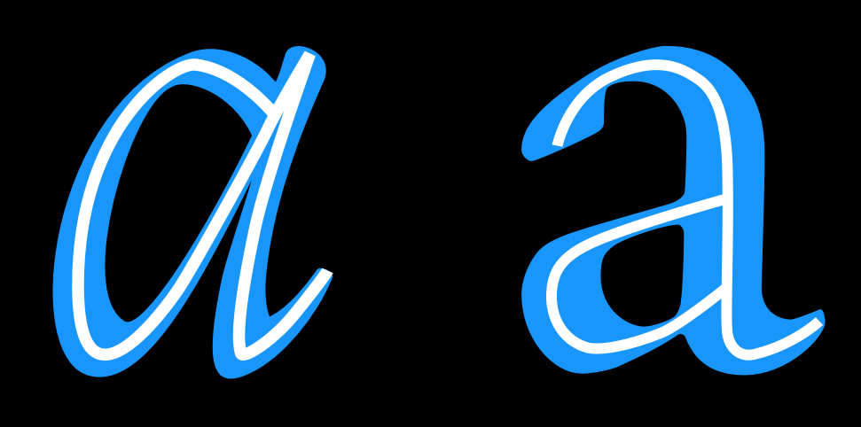

Construction은 특정 glyph의 기초가 되는 획을 의미합니다. 사용하고 있는 construction의 종류는 아마도 가장 중요한 질문 중 하나일겁니다. 왜냐하면 construction은 서체가 보는 이들에게 친숙하게 보이는지를 비롯하여 많은 다른 선택에 영향을 줍니다. 위의 예에서 letter들 안의 하얀 선은 글자 자체의 모양에서 추정되는 construction을 나타냅니다.

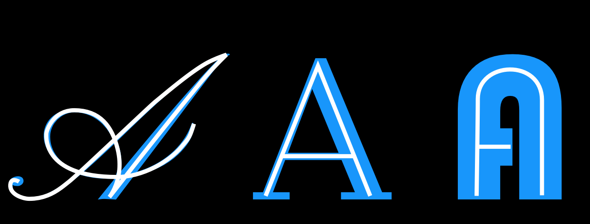

Construction refers to the structure of the underlying strokes that form a particular glyph. Perhaps
you can imagine the glyph’s skeleton. The kind of construction to use is arguably one of the most
important questions to think about, because the construction effects so many of the remaining
choices, particularly if your design is going to feel somewhat familiar to readers.

However, the way strokes end (the ‘terminals’) and the ‘serifs’ (see below) are generally not part
of what is meant by ‘construction.’ Construction is the skeleton of the glyph, while rest &ndash;
width, weight, terminals &ndash; are all parts of the flesh.

In the example above, the white line inside the letters indicate the approximate construction
suggested by the shape of the letters themselves.

### Proportion of X-height to Cap-height

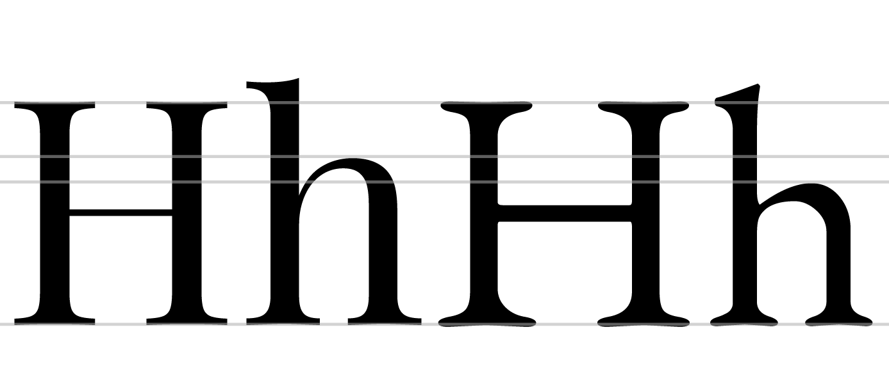

The letters on the left come from [Playfair Display], which has a large x-height relative to its
cap-height. The letters on the right are from [EB Garamond], which has a smaller x-height. In the
sample above, the size of the H has been adjusted so that they match.

### Ascender Height

In the example above, the x-heights have been matched in order to illustrate the relative difference
in ascender heights.

Ascenders usually exceed the cap-height by at least a little, especially in text designs. In some
cases, however, they can match or even be lower than the cap-height. Longer ascenders can add
elegance to the look of a typeface. They often go with smaller x-height.

### Descender depth

Like ascenders, descenders that are long can feel elegant. 

Taken together, long ascenders and descenders can become difficult to manage. If the typeface will
be used with small line heights, the elongation means letter can collide across rows of text.

## Width

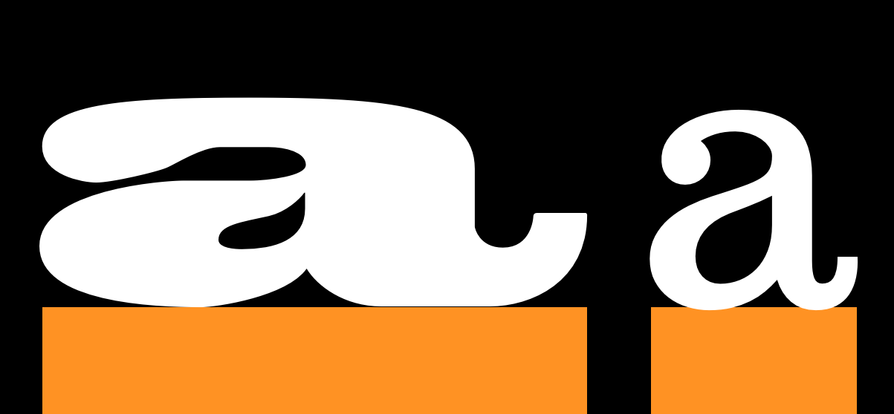

The width of a type design will alter not just how it feels but also what it is useful for. The
example on the right is from a text face. The example on the left is from a display design meant to
be eye catching. Letters that are more narrow than the text face example are also possible and can
be used to save space or to fit more text in a smaller space.

### Width regularity versus variability

The letters in the top row of this example show a greater variety of width than do the letters in
the bottom row.

### Weight

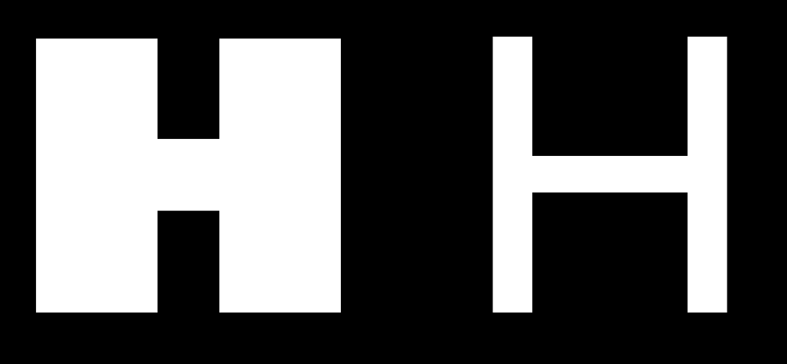

### Slant

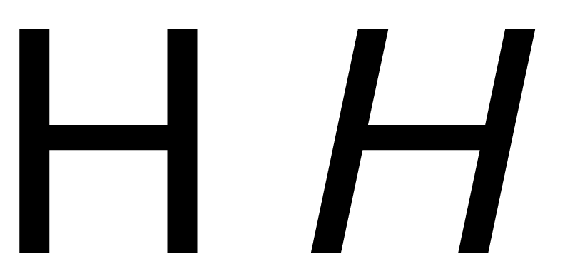

### Contrast

Contrast refers to how much variation in stroke width is found within a glyph. Notice in the below
two ‘O’ glyphs that the one on the left has much greater variability in line thickness between the top
and sides of the glyph. Both glyphs have some contrast, but the one on the left has much more than
the one on the right.

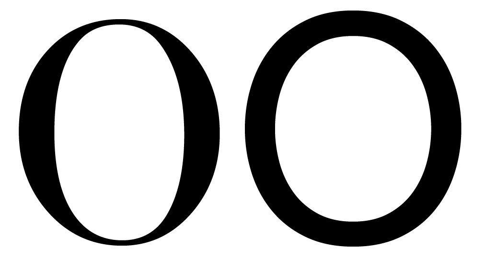

Type with consistent weight (stroke width) in its letterforms or no visible contrast produces a
sheer distinction from uncontrasted type. Like the choice between serifs or sans-serifs, contrast is
an early choice of type design. It is interesting to note that ‘slab’ serif designs generally use
consistent stroke width in their letters, and that the design of slab serifs is not merely about the
serif, as it sounds! It must be remembered that the rules of perception apply (see [“Trusting your
eyes”]) &ndash; contrast is about how the weight looks but not how it measures out to be.

### Angle of contrast

In the below image, we see that the thin parts of the lower case letter ‘o’ shapes are different. In
the glyph on the left, the thin points lie on a perfectly vertical axis. In the glyph on the right,
the axis is diagonal.

### Weight distribution

If your font uses very little to no contrast, you don’t really need to think of it.  
Most fonts, however, have at least some degree of contrast. In these cases, you have a wide variety
of options to choose from when it comes to how to distribute the weight in your font.

#### Vertical

Vertical distribution of weight is very common. The 9 and 8 above are a particularly intense
example.

#### Horizontal

Horizontal weight distribution is much less common, but is nonetheless seen in many fonts.

#### Bottom-heavy

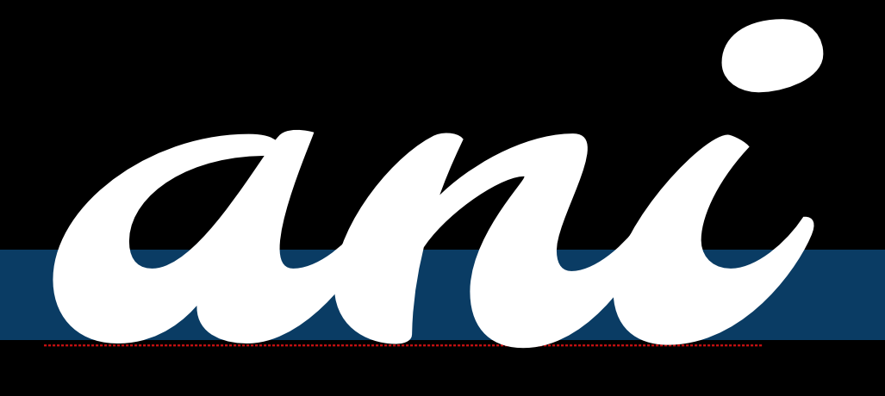

#### Top-heavy

#### Irregular

### Stems

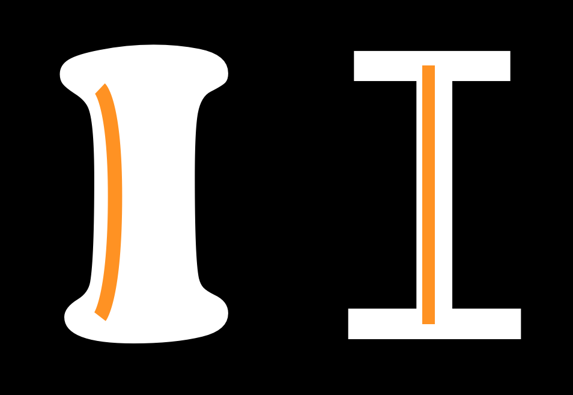

It is easy to assume that your stems will simply be straight and that this isn’t a real concern, but
both the weight and the shape of your stems are things you can and should make deliberate choices
about.

### Joins

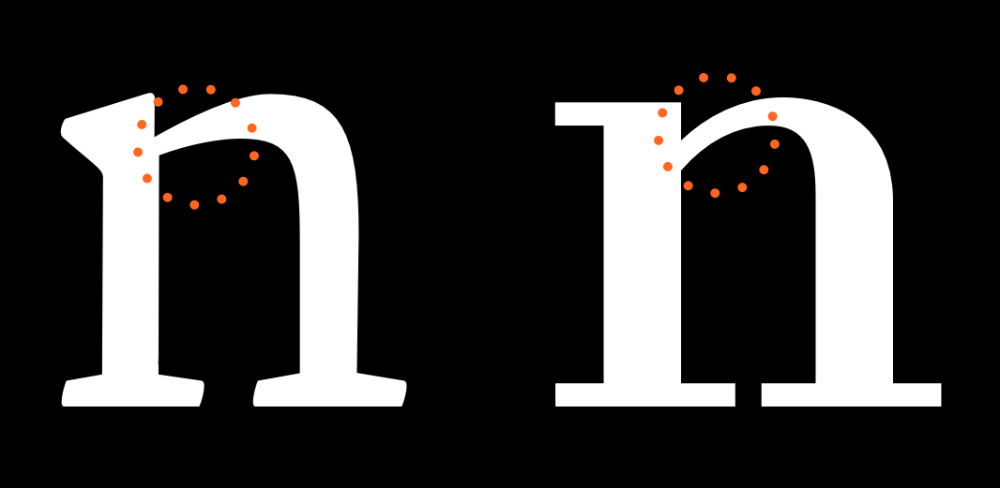

### Bowls

Note that bowls are the stroke part in the below illustrations and not the black inner forms. The
inner strokes are referred as “counters”. While designing type, you will often find yourself
altering your work not because of the shape or width of the stroke but due to the shape and size of
the counter.

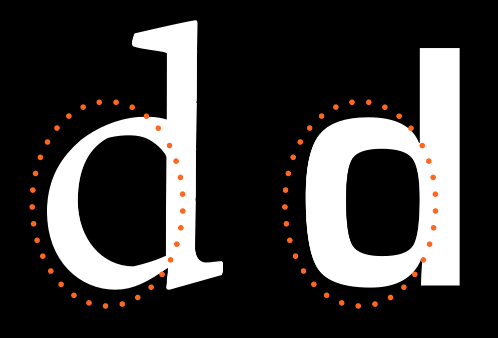

### Terminals

Terminals are the end forms of the strokes. They are not same as the serifs. They are often
perpendicular to the angle of the stroke at its end, or sheared horizontally or vertically. They may
also reflect the shape of the nib or other mark-making tool that the letter forms evoke.

### Speed

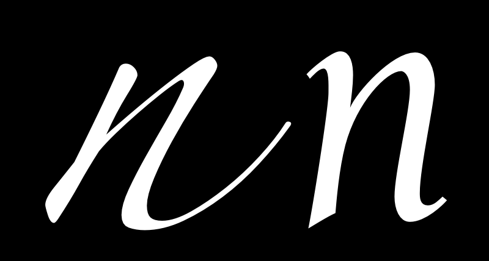

The ‘n’ on the left seems to be written much faster than the one on the right. Speed is discussed in
more detail in the chapter [on italics].

### Regularity

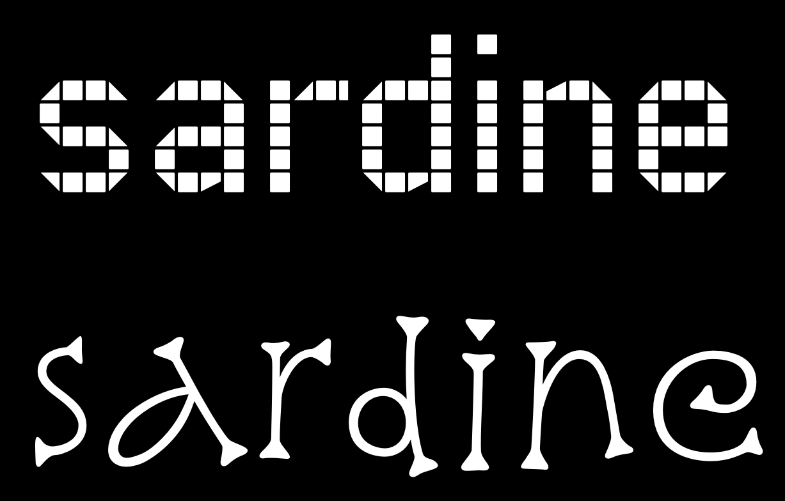

The following characteristics are not present in all type designs, however they are variables that
may be a part of your design. If this is the case, it is worth considering the degree to which they
will play a role as a variable.

### Flourish

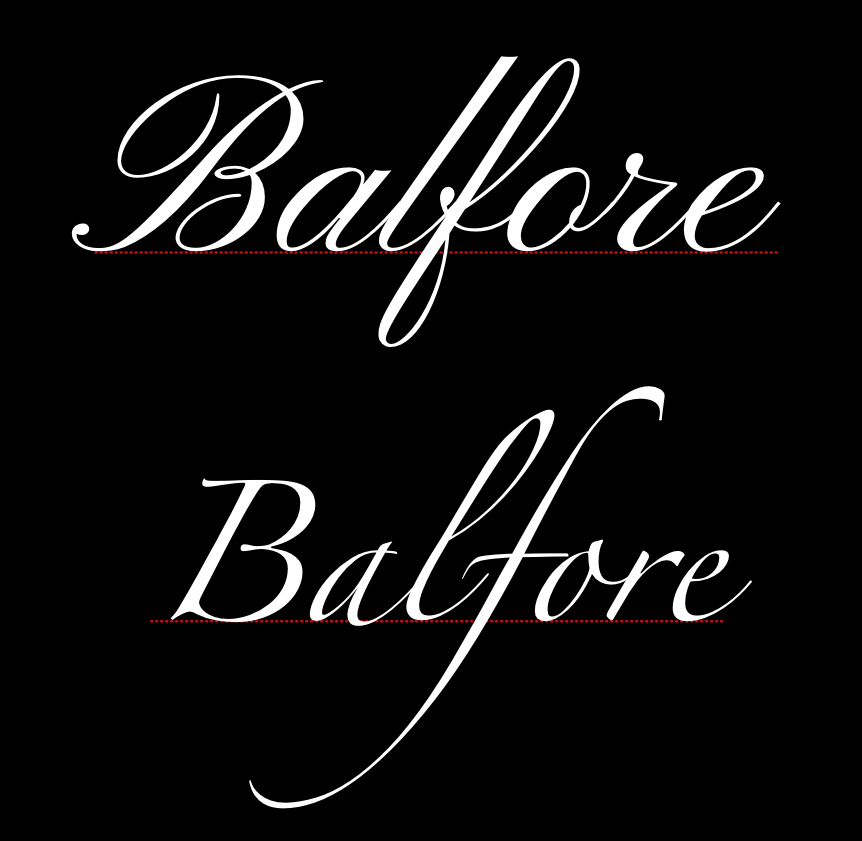

Notice that in the font on top the flourish is more present in the capital letter and the second one
the flourish is more in the lowercase.

### Serif - To be or not to be

Serifs are one of the most distinct aspects of a typeface, and often the first classification of
type is between serif and sans-serif type.

This choice affects how the end terminals will look like. Serifs can be two sided or one sided. They
can be perpendicular to stroke or have their own direction (like being always horizontal or
vertical). Serifs can be with or without brackets. Any serif design is a mix of all of the above
applied consistently to the type design with some deviations for particular letters, especially the
‘S’, ‘C’ and ‘Z’ (e.g. a type with horizontal serifs for all letters will often have s, c and z to
have vertical serifs).

There is a urban legend asserting that serif types are easier to read than sans-serifs &ndash; it is
[a sole myth](http://asserttrue.blogspot.se/2013/01/the-serif-readability-myth.html), until further
notice.

The form of the serifs are related to the forms of the terminals.

#### Brackets

The corner portions of a serif where it connects to the main stroke are called ‘brackets’. A
particular design may have them giving a soft feel to the serif ([Times New Roman] is an example) or
may choose to not have any bracket. Some designs also use brackets only on one side or with
different proportions on the two sides.

This is a relatively strong parameter that renders feel to the type &ndash; elegance (smooth or
large brackets of [Times New Roman]) or chunky crisp (absent brackets of [Arvo]).

#### Slab-serifs

Also called mechanistic or Egyptian type, slabs are thick, block-like serifs. Slab serifs don’t use
brackets. Generally speaking, type design with such serifs are seen to have less contrast in their
glyphs &ndash; [Rockwell], [Courier] or [American typewriter] reflect that.

It may be safe to assume that slab serifs have been used to add some ornament or rhythm to an
otherwise no-contrast type design. But this is not an absolute rule.

#### Serif Terminals

Just like letter terminals, the end shape of the serifs themselves contribute to the feel of the
type &ndash; either soft or chunky. Serif terminals can be soft and rounded ([Courier]) or blunt and
angular ([Rockwell]).

### Decoration

### Dimension

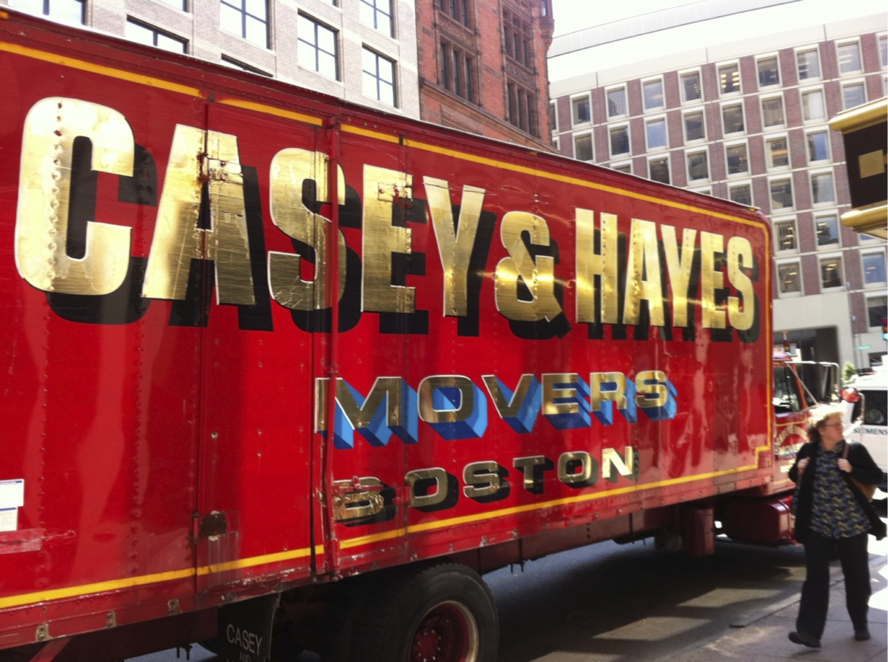

[Playfair Display]: http://www.forthehearts.net/typeface-design/playfair-display/
[EB Garamond]: http://www.georgduffner.at/ebgaramond/
[“Trusting your eyes”]: Trusting_Your_Eyes.html
[on italics]: Italic.html
[Times New Roman]: http://practicaltypography.com/times-new-roman.html
[Arvo]: http://files.korkork.com/index.php?/fonts/arvo/
[Rockwell]: http://www.myfonts.com/fonts/mti/rockwell/
[Courier]: http://typedia.com/explore/typeface/courier/
[American typewriter]: http://www.myfonts.com/fonts/linotype/itc-american-typewriter/

